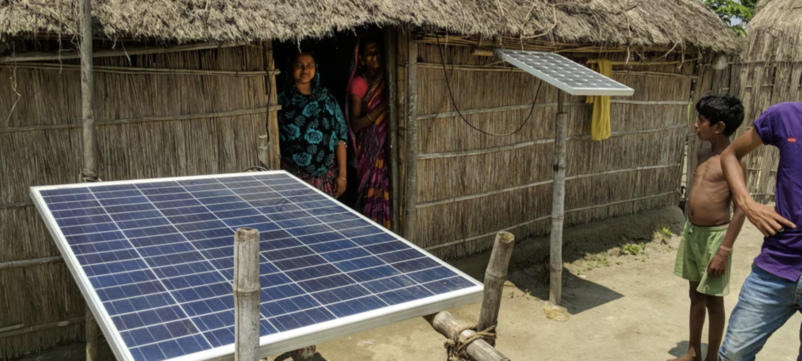

Most of us know that feeling when we wake up and realize our phone died overnight, and we forgot to plug it in. But beyond that moment, we don’t think much of the electricity we rely on. We flip on lights without thinking, pour a cold drink from the fridge, unwind in air conditioning after a long day, and walk home beneath the streetlights late at night without a second thought.

{width="100%"} 

[Image Source](https://www.weforum.org/stories/2020/01/can-emerging-economies-leapfrog-the-energy-transition/)

For many people, though, like the boy in this picture, those everyday comforts are not routine at all. They have grown up without reliable electricity and without the opportunities, safety, and ease it quietly provides.

Access to electricity provides many benefits that are crucial for developing countries to grow and advance. Electricity is a form of healthcare, keeping food refrigerated and safe, making healthy food more available, refrigerating vaccines and other medicines, and providing necessary light and technologies for life-saving operations and procedures. Electricity improves safety by lighting up streets and houses. It improves education by making it possible to study after dark, opens access to global knowledge and communication through the internet, and creates learning environments where students can reliably engage with modern tools and resources. Clean green energy, in particular, can replace other forms of polluting energy, improving air quality on a local and global scale. Clean energy can also provide energy to homes without being reliant on a centralized grid or infrastructure that is often lacking in developing countries. 

Today, developed high-GDP countries are beginning to make the transition to clean energy.
While this transition is vital, many developing countries lack access to reliable energy as a whole. Expanding access to clean energy in low-GDP countries presents a rare dual opportunity: to accelerate the global move toward sustainability while also providing a critical foundation for socioeconomic development, economic growth, and improved quality of life.

This site explores and compares the use of clean energy in high-GDP countries and low-GDP countries, giving insight into how we can improve global access to energy and promote clean green energy worldwide. 

[GitHub Site](https://burnssg0.github.io/energy/)

([GitHub Repo](https://github.com/burnssg0/energy))
