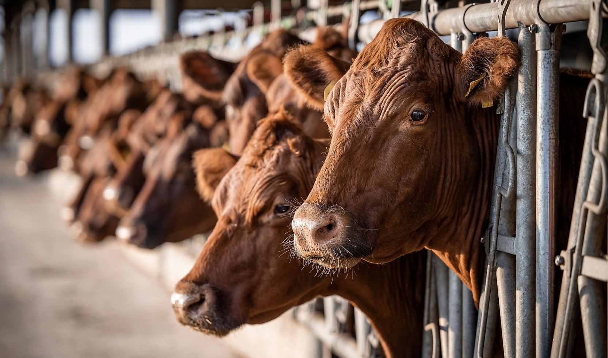

[Image Source](https://www.kemin.com/na/en-us/blog/food/beef-prices-on-the-rise)

It is hard to escape the problems our world faces. You don’t have to look far to see how our actions are cutting deep into the natural processes of our planet. Even when we aren’t searching for it, our teachers, peers, and the news remind us how the world is hurting and how we are part of the problem. Our generation has come of age alongside climate change. Perhaps this reflects present bias; however, as young adults, we are directly experiencing and feeling the detrimental effects of climate change as they become increasingly visible, recognized, and understood. “Global warming,” “sea level rise,” “carbon emissions,” “greenhouse effect,” “fossil fuels,” “pollution”—the list goes on—have been familiar words since grade school. Since we could talk, we have been spoon-fed solutions: turn the water off when you brush your teeth, “keep calm and don’t litter.” We recycle and turn out the lights, yet we still watch the world crumble before our eyes. The prolonged and consistent saturation of information we receive can make us apathetic, indifferent, detached, and unconcerned, even while we call ourselves environmentalists.

As a 20-something “environmentalist” in college, I have often felt limited in how I can best serve the environment; while I try to live sustainably, I feel hindered in what I can actually do to combat climate change. Amidst today’s climate crisis, most of our actions to combat climate change focus on the transition to clean energy and reducing our reliance on fossil fuels. I try to limit my carbon footprint by minimizing driving and flying, but with short school breaks and my family living across the country, I find myself prioritizing my family over my carbon emissions. I turn out the lights when I can and try to minimize my energy use, but I have little control over Sewanee’s transition to clean energy. I even live in the Greenhouse, a sustainable-themed living community, but our house is poorly insulated and drafty, an energy suck. In this stage of life, I am often unable to choose the sustainable path. While these conventional pursuits are vital, they are often less effective in my life right now. 

This site explores a different possible path to climate action: the way we eat. This project will explore how what we eat impacts the environment and how small changes in our diet could help combat climate change.

[GitHub Site](https://burnssg0.github.io/vegetarian/)

([GitHub Repo](https://github.com/burnssg0/vegetarian))
