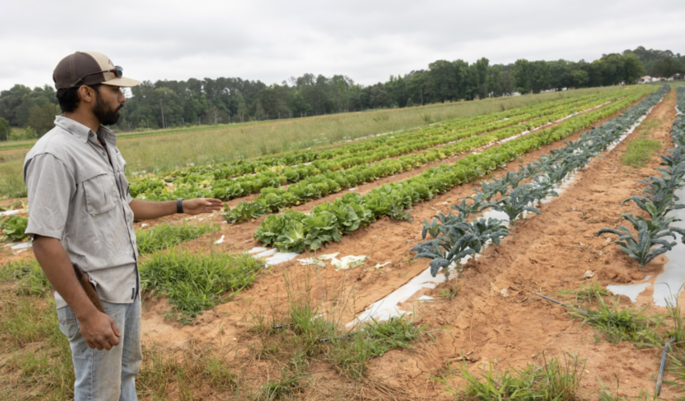

What did you have for breakfast this morning? 

Maybe it was eggs and bacon? Maybe it was a bowl of cereal? Maybe it was just a cup of coffee. 

Whatever it was, I'm going to guess that while you ate it, you probably didn't think much about where it came from. Not even the store it came from, but the land, seeds, the people who planted the seed, watered the crop, and harvested the product. 

[Image Source](https://www.conservationfund.org/our-impact/news-insights/connecting-the-next-generation-of-farmers-to-the-land/)

We have become increasingly disconnected from the origin of our food: **farms**. Yet beyond sustaining us with the food we all consume every single day, farms have crucial social and ecological benefits that we often fail to recognize. 

Farmland has complex cultural and social implications, connecting the people who farm the land to their land. These connections have deep implications for the health of the local community as well as the farming populations as a whole. 

Ecologically, farmland, with good stewardship, provides a slew of ecosystem services. Farms can sequester carbon in the soil, help regulate water quality and water flow, provide habitat for species, and the list goes on. However, with poor management, farming can have immense detrimental effects on the environment as well.  

For these reasons, it is crucial that we understand what is happening to our farmland, and to understand that, we have to understand how these people are connecting to their land and caring for their land. 

This project explores the complex and intricate stories of farmers. These stories can give us insight into what will happen to farmland in the future and help us better understand how farmers relate to their land. By recognizing farmers’ more complex stories, we begin to see what farmers care about, and as environmentalists, we can relate to these shared values to help promote more sustainable practices.

[GitHub Site](https://burnssg0.github.io/data_story_3/)

([GitHub Repo](https://github.com/burnssg0/data_story_3))