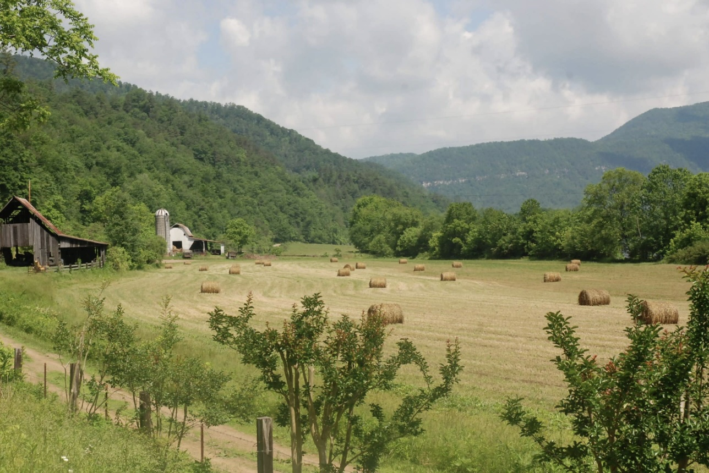

 

[Image Source](https://www.landtrusttn.org/blog/the-farmland-preservation-act-what-it-means-for-tennessee-farmers/)

As mentioned in my previous blog post, [Looking Under the Crop and into the Weeds](../../posts/2026-05-04-data-story-3/index.qmd), the stories and complexities behind farming are crucial for predicting what farmland will look like in the future and for understanding how farmers connect to their land. Recognizing the values that farmers associate with their land is essential for developing meaningful policies and cultivating environmentally friendly practices.

Beyond providing economic gains, farmland also holds important non-monetary values for farmers. To better understand how farmers relate to their land, we asked them directly. Through these conversations, we gain insight into what this land means to people and how those values shape the way it is managed.

This project includes a data entry app for recording responses during these interviews, as well as a website that explores and highlights some of this qualitative data.

[GitHub Site](https://burnssg0.github.io/data_story_5/)

([GitHub Repo](https://github.com/burnssg0/data_story_5))
